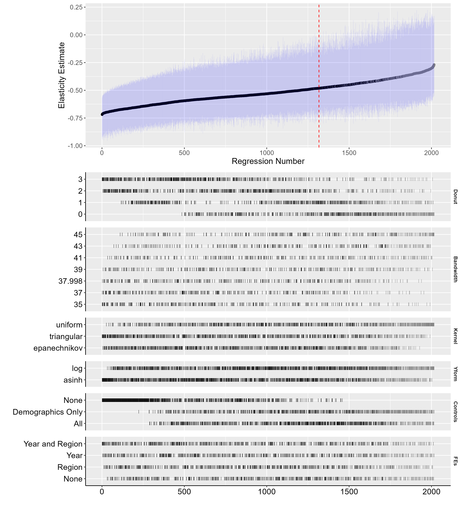
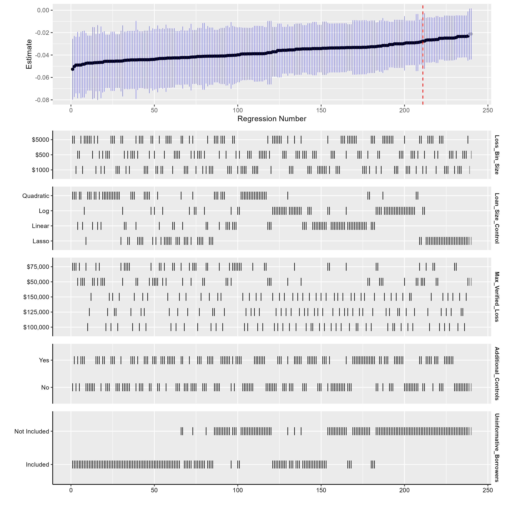
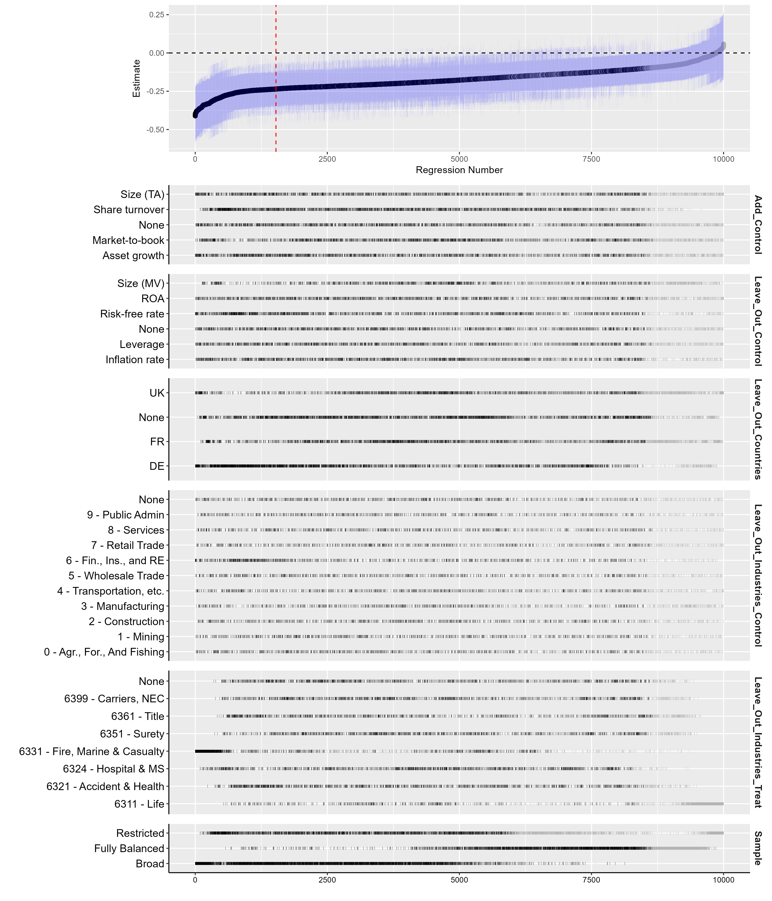

# Specification Curve Analysis in R

This repository contains modifiable (not canned) code based on the R package `specr` to create extremely flexible and visually appealing specification curves in R. The code is designed to be intuitive and customizable, allowing you to adapt it to your specific project needs. The repository includes two main files:

1. **Model Running File**: This file runs all the models. It requires significant customization based on your project, but it is structured in a way that makes it easy to adjust. AI coding models, such as Cursor, can assist in tailoring this file to your specific requirements. I find uploading your primary analysis file and then a list of the specifications you want to try gets you 90% of the way there.

2. **Curve Printing File**: This file takes the outcomes from the model running file and prints the specification curves. It includes markers ("#### MANUAL CHANGE REQUIRED ####") to indicate where manual adjustments are necessary. AI coding models, such as Cursor, will also assist here and can typically one-shot this file when you also upload the model running file.

## Sample Output Figures

Below are some sample output figures generated by the code:

Figure 1: Ellis, Cameron and Esson, Meghan and Liebman, Eli, Moral Hazard on the ACA Exchanges: Evidence from a Cost-Sharing Subsidy Discontinuity (July 12, 2024). Available at SSRN: https://ssrn.com/abstract=4892925 

Figure 2: Example from Collier, Benjamin and Ellis, Cameron and Keys, Benjamin J., The Cost of Consumer Collateral: Evidence from Bunching (January 1, 2022).  Available at SSRN: https://ssrn.com/abstract=4048069 

Figure 3: Example from Ellis, Cameron and Ueno, Takefumi and Veith, Stefan, The Solvency II Framework: Causal Effects on Risk and Liquidity (August 29, 2024). Available at SSRN: https://ssrn.com/abstract=4940529 

See the above referenced papers for sample language you can use to describe these figures.

## Citations

Please cite the following if you use this code in your research:

- Simonsohn, U., Simmons, J.P. & Nelson, L.D. (2020). Specification curve analysis. Nature Human Behaviour, 4, 1208–1214. https://doi.org/10.1038/s41562-020-0912-z
- Masur, Philipp K. & Scharkow, M. (2020). specr: Conducting and Visualizing Specification Curve Analyses. Available from https://CRAN.R-project.org/package=specr.
- Ellis, C. (2024). Customizable Specification Curves in R [Computer software]. https://github.com/cellis212/Customizable-Spec-Curves-R

## Getting Started

To get started with this code, follow these steps:

1. **Clone the Repository**: Clone this repository to your local machine using `git clone` or download the .zip. 
2. **Install Required Packages**: Ensure that you have the necessary R packages installed. The required packages are loaded at the top of each script.
3. **Customize the Model Running File**: Adjust the model running file to fit your specific project needs. This includes defining your data, model specifications, and any control variables.
4. **Run the Model Running File**: Execute the model running file to generate the model outcomes.
5. **Customize the Curve Printing File**: Make any necessary manual adjustments to the curve printing file as indicated by the markers.
6. **Generate Specification Curves**: Run the curve printing file to generate and save the specification curves.

## License

This project is licensed under the MIT License - see the [LICENSE](LICENSE) file for details.

